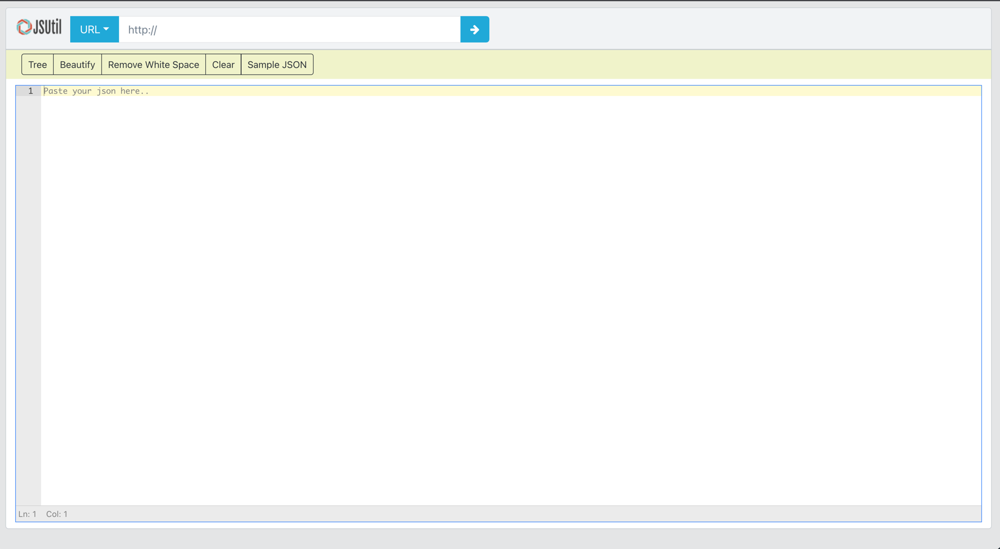
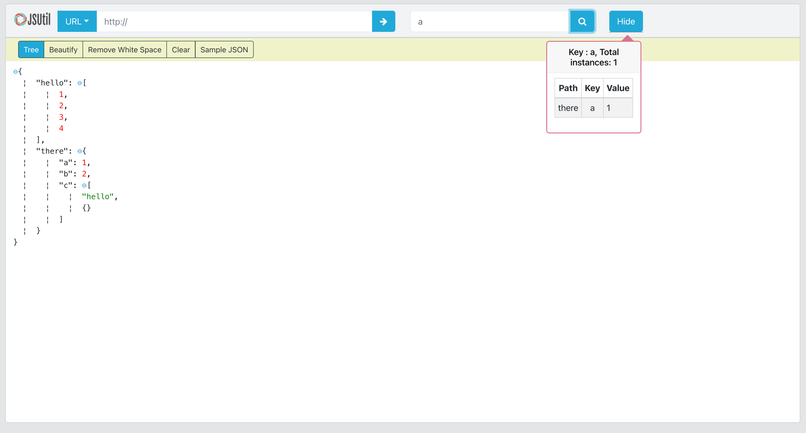

<div align="center">
 <h1> <Image src="https://jsutil.netlify.app/app-logo-2.png" width="80px"><br/>JSON Finder Util</h1>
</div>
<br/>

Online JSON viewer which provides a way to search all the values in json with keys and path.


**Website: [JSUTIL](https://jsutil.netlify.app/)**

> Work in Progress




#### Online JSON Viewer, Search all values in json with keys and path

## Tech Stack


## Getting Started For development

First, run the development server:

```bash
npm run start
# or
yarn start
```

## Production Build

First, run the development server:

```bash
npm run build
# or
yarn build
```

Open [http://localhost:3000](http://localhost:3000) with your browser to see the result.

## Deploy on Netlify

The easiest way to deploy your app is to use the [Netlify Platform](https://docs.netlify.com/?_gl=1%2ayk5szy%2a_gcl_au%2aMzY2MzU4MzgzLjE2OTM1NTM4MTg.) from the creators of Next.js.
